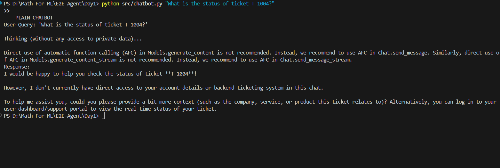
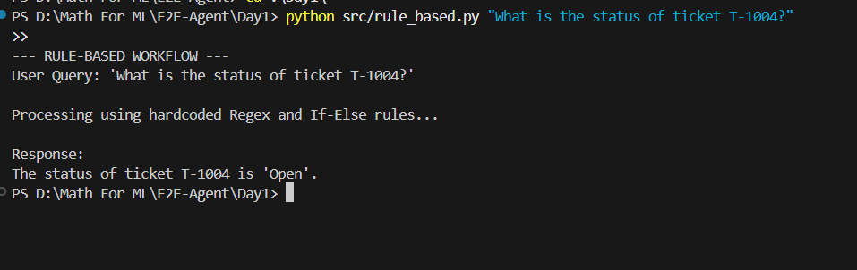
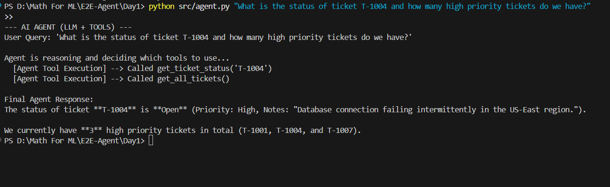

# Output Screenshots

Place your screenshots of running `chatbot.py`, `rule_based.py`, and `agent.py` in this folder before submitting your repository.

**To generate the screenshots:**
1. Open your terminal in the `Day1` folder.
2. Ensure you have added your real Gemini API key to the `.env` file.
3. Run the following commands and take a screenshot of each:
   - `python src/chatbot.py "What is the status of ticket T-1004?"`
   
   

   - `python src/rule_based.py "What is the status of ticket T-1004?"`
   
   

   - `python src/agent.py "What is the status of ticket T-1004 and how many high priority tickets do we have?"`

   
